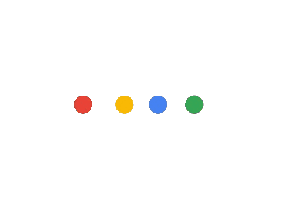
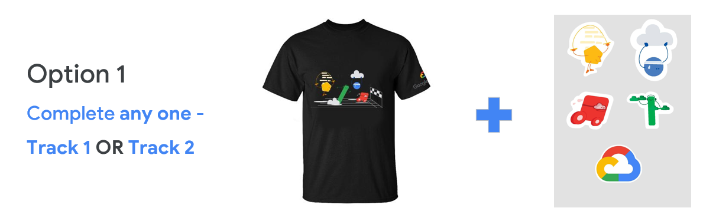
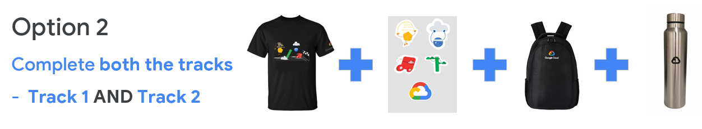

<h1 style="display:flex; padding-top:5px; align-items:center; justify-content:center;">

30-Days-of-Google-Cloud, NITJ
 
</h1>

<h2 style="display:flex; padding-top:5px;">

&nbsp;About:
 
</h2>

30 Days of Google Cloud program will provide you an opportunity to kickstart your career in cloud and get hands-on practice on Google Cloud - the tool that powers apps like Google Search, Gmail and YouTube.

 
<h2 style="display:flex; padding-top:5px;">

&nbsp;Track 1: Cloud Engineering Track
 
</h2>

1. Skill Badge: [Getting Started: Create and Manage Cloud Resources](https://google.qwiklabs.com/quests/120)
2. Skill Badge: [Perform Foundational Infrastructure Tasks in Google Cloud](https://google.qwiklabs.com/quests/118)
3. Skill Badge: [Setup and Configure a Cloud Environment in Google Cloud](https://google.qwiklabs.com/quests/119?utm_source=google&utm_medium=lp&utm_campaign=gcpskills)

4. Skill Badge: [Deploy and Manage Cloud Environments with Google Cloud](https://google.qwiklabs.com/quests/121?utm_source=google&utm_medium=lp&utm_campaign=gcpskills)

5. Skill Badge: [Build and Secure Networks in Google Cloud](https://google.qwiklabs.com/quests/128?utm_source=google&utm_medium=lp&utm_campaign=gcpskills)

6. Skill Badge: [Deploy to Kubernetes in Google Cloud](https://google.qwiklabs.com/quests/116?utm_source=google&utm_medium=lp&utm_campaign=gcpskills)

<h2 style="display:flex; padding-top:5px;">

&nbsp;Track 2: Data Science & Machine Learning Track
 
</h2>

1. Skill Badge: [Getting Started: Create and Manage Cloud Resources](https://google.qwiklabs.com/quests/120)
2. Skill Badge: [Perform Foundational Data, ML, and AI Tasks in Google Cloud](https://google.qwiklabs.com/quests/117?utm_source=google&utm_medium=lp&utm_campaign=gcpskills)
3. Skill Badge: [Insights from Data with BigQuery](https://google.qwiklabs.com/quests/123)
4. Skill Badge: [Engineer Data in Google Cloud](https://google.qwiklabs.com/quests/132)
5. Skill Badge: [Integrate with Machine Learning APIs](https://google.qwiklabs.com/quests/136?utm_source=google&utm_medium=lp&utm_campaign=gcpskills)
6. Skill Badge: [Explore Machine Learning Models with Explainable AI](https://google.qwiklabs.com/quests/126?utm_source=google&utm_medium=lp&utm_campaign=gcpskills)

<h2 style="display:flex; padding-top:5px;">

&nbsp;Rules:
 
</h2>

- You're supposed to start with QwikLabs from 27th September and end it by 27th October, 11:59 PM (IST).
- To earn goodies and a certificate, you'll have to complete at least 1 track.
- You will receive more information on how to avail your Google Cloud goodies after the program ends **ONLY** if you are eligible for prizes.
- See the [FAQs](https://events.withgoogle.com/30daysofgooglecloud/faqs) section for more information on prizes.

<h2 style="display:flex; padding-top:5px;">

&nbsp;Rewards:
 
</h2>

 

<h2 style="display:flex; padding-top:5px;">

&nbsp;Connect with us:
 
</h2>

    
    
    
 

Show some  ❤️ by supporting us!  Star our repository.

